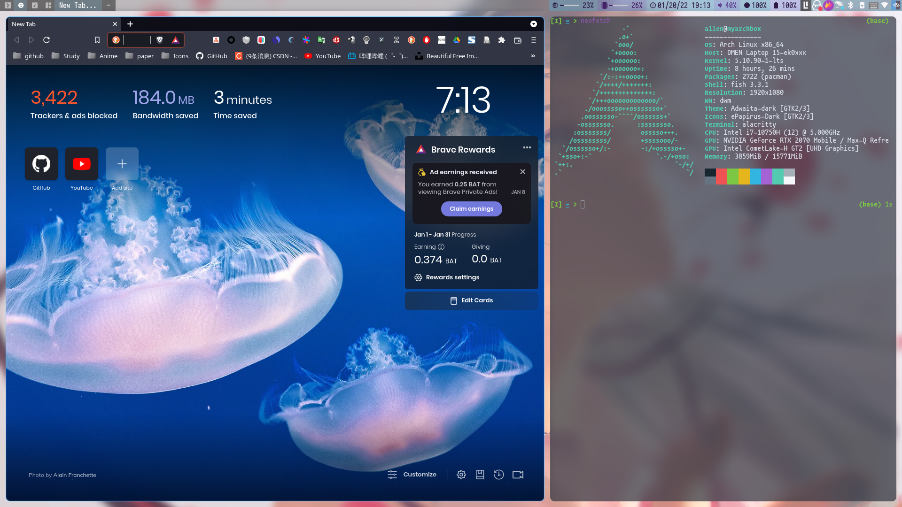
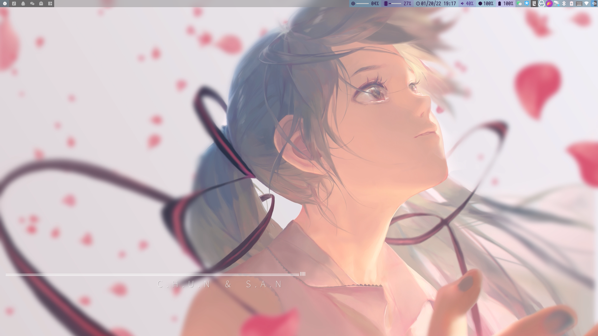
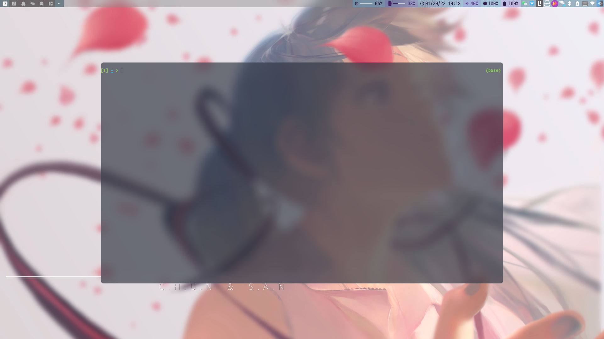
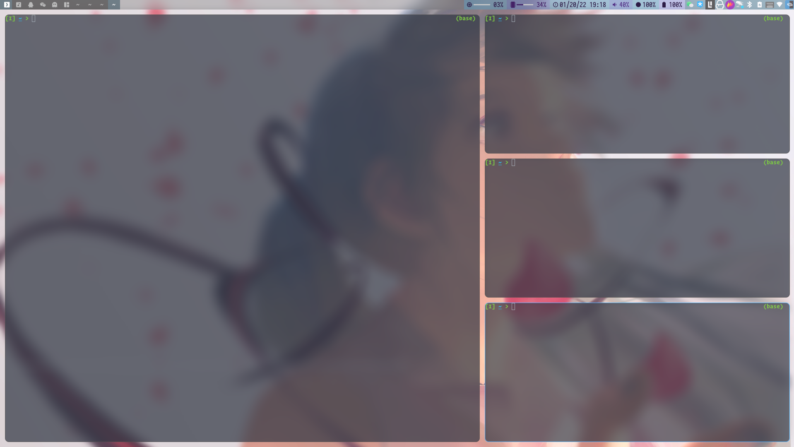
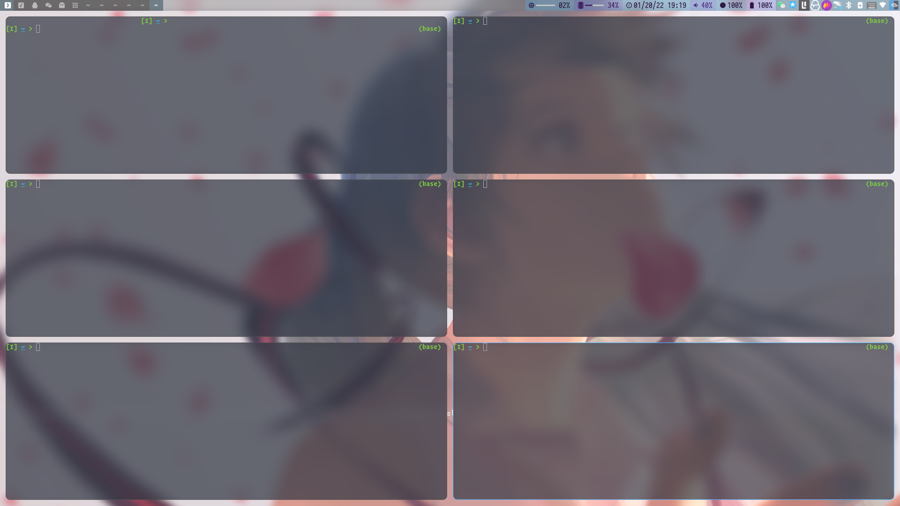

<!-- markdownlint-disable MD033 MD041 -->
<p align="center">
  <a href="https://github.com/Allen191819/dwm"></a>
</p>

<div align="center">

# Dwm

<!-- prettier-ignore-start -->
<!-- markdownlint-disable-next-line MD036 -->
_✨ Dynamic window manager config ✨_
<!-- prettier-ignore-end -->

</div>

## Introduction

 

dwm is a dynamic window manager for X. It manages windows in tiled, monocle and floating layouts. All of the layouts can be applied dynamically, optimising the environment for the application in use and the task performed.

In tiled layout windows are managed in a master and stacking area. The master area contains the window which currently needs most attention, whereas the stacking area contains all other windows. In monocle layout all windows are maximised to the screen size. In floating layout windows can be resized and moved freely. Dialog windows are always managed floating, regardless of the layout applied.

Windows are grouped by tags. Each window can be tagged with one or multiple tags. Selecting certain tags displays all windows with these tags.

Each screen contains a small status bar which displays all available tags, the layout, the number of visible windows, the title of the focused window, and the text read from the root window name property, if the screen is focused. A floating window is indicated with an empty square and a maximised floating window is indicated with a filled square before the windows title. The selected tags are indicated with a different color. The tags of the focused window are indicated with a filled square in the top left corner. The tags which are applied to one or more windows are indicated with an empty square in the top left corner.

## Overview












## Installation 

```bash
sudo make clean install
```

## Configuration

+ You can customize keymap in [config.h](./config.h).
+ You can add something by adding patches from [here](https://dwm.suckless.org/patches/).

## Scripts 

All of the scripts which is necessary included dwm-status and autostart program are [here](https://github.com/Allen191819/scripts).
